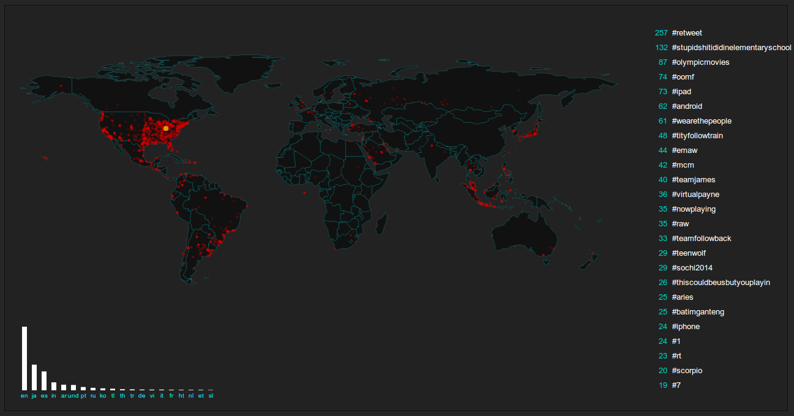

Haystack
========

A Straw based Twitter consumer.

This is an example of how to use [Straw](https://strawjs.com) to
handle real-time dataflow.

Updated for Straw v0.3.*



## Quck Start

Ensure you have Redis

```bash
sudo apt-get install redis-server
```

Ensure you have Bower

```bash
npm install bower -g
```

Install Haystack and it's dependencies

```bash
git clone https://github.com/simonswain/haystack.git
cd haystack
npm install
bower install
```

Create the config file

```bash
cp config/config.sample.js config/config.js
```

Edit `config/config.js` and enter your API keys - get them from
[dev.twitter.com](http://dev.twitter.com/)

```javascript
exports.twitter = {
  consumer_key: '',
  consumer_secret: '',
  access_token_key: '',
  access_token_secret: ''
}
```

Run the Straw topology to start data collection and processing

```bash 
~/haystack$ node run
```

Open another shell and start the webserver

```bash 
~/haystack$ node server
```

Open `http://localhost:3000` to see some results.


## Presentation

Straw and Haystack were presented at JSConf.asia 2013 - [Data-flow
Processing for Node.JS with
Straw](https://www.youtube.com/watch?v=Q0iBoqhUVck)


Dataflow programming with Straw
===============================

(This post originally appeared on Sitepoint.com - it has been updated
here for Straw v0.3)

Dataflow is a programming model that has been around since the dawn of
computing.

Although Dataflow has languished in obscurity for much of that time,
it's finding new life in the current explosion of web scale real-time
services, and is a natural fit for many of of the engineeing
challenges these present.

Dataflow is a simple concept. Small nodes of code receive input,
process it, and output results. Nodes are connected together, outputs
to inputs, forming a processing topology.

Using Dataflow, complex problems becomes easy to reason about, systems
are easier to scale and make resilient, and you can make better use of
your computing resources.

Straw is a Node.JS framework that lets your implement dataflow
processing in your app.

```
strawjs.com
https://github.com/simonswain/straw
```

I'm going to introduce you to Straw by showing you how to mine the
Twitter Firehose for data from tweets.

Because the Firehose is a continuous stream of messages, it's ideal
for processing with Straw. We'll be using the free public version that
only has a small percentage of all tweets. Even so, it will be plenty.

In Straw, you define a topology of Nodes. Each node has an input and
zero or more outputs.

Nodes can receive messages. When a Node receives a message, it
processes it with a function you write. That function can output
messages that will be received by any connected nodes.

We are going to write several nodes - one to consume the raw data from
the Firehose and extract the bits we are interested in, one to send
each of those bits to a node that analyses them, and the actual
analysis nodes.

From there, we'll push out the data to an Express server and over web
sockets to our client-side visualisation.

There are a bunch of things to look at, so it's best you install the
demo app, Haystack, on your local machine. This give you code to walk
through and let you see Straw in action.

Once you understand how the parts fit together, you should expand on
this basic demo -- fork the repo and lets see how full featured we can
make it.

Haystack is on Github:

```
https://github.com/simonswain/haystack
```

You will have to have [Redis](redis.io) installed. If you're using
Ubuntu, this will get you there quick smart:

```
sudo apt-get install redis-server
```

Or you can try [Installing Redis on Mac OS
X](http://jasdeep.ca/2012/05/installing-redis-on-mac-os-x)

You will also need Bower if you don't already have it:

```
npm install -g bower
```

Clone yourself a copy of Haystack to your local machine:

```bash
git clone https://github.com/simonswain/haystack
cd haystack
npm install
bower install
```

To access the Twiter Firehose you will need to get yourself some API
credentials by creating yourself an App on Twitter.

This will let your local copy of Haystack connect to Twitter's API and
stream in raw data from the Firehose.

Go to `https://apps.twitter.com`, sign in and create a new App. The
App you create will just need Read Only permissions.

Once created, visit the API Keys tab and copy values you need

Haystack comes with a sample config file. Copy it and enter your
credentials from Twitter.

```bash
cp config/config.sample.js config/config.js
```

```javascript
exports.twitter = {
  consumer_key: '{put yours here}',
  consumer_secret: '{put yours here}',
  access_token_key: '{put yours here}',
  access_token_secret: '{put yours here}'
}
```

Your local copy of Haystack should be ready to go now.

Haystack has two parts -- the Straw topology for dataflow, and the
Express server for the web front-end -- So to run it you'll have to
have two separate shells open:

Open a shell and run the topology

```bash
~/haystack$ node run
```

You should see some output as the topology starts up, then a list of @usernames as tweets come in.

Open another shell to run the webserver

```bash
~/haystack$ node server.js 
Haystack server listening on port 3000
```

Then visit the site on `http://localhost:3000`

You will see a screen with a world map pinging in tweets as they
happen, a histogram of languages, and the top hashtags. This will all
be updating in real-time.

Lets have a look at the dataflow and the code to make it happen.

`run.js` boots up our Straw toplolgy.

When we create our topology, we pass it an object describing the nodes
we want and how they are connected together.

This fragment shows that `consume-firehose` has an output connected to
a pipe called `raw-tweets` and a node called `route-tweets` receives
it's input from that pipe, so any messages output by
`consume-firehose` will be passed to `route-tweets` and so on through
the topology.

We also pass the API details for Twitter in to the node so it knows
what credentials to use. You can pass anything extra you want in to a
node.

```javascript
var topo = straw.create(opts);

topo.add([{
  id: 'consume-firehose',
  node: 'consume-firehose',
  output: 'raw-tweets',
  twitter: config.twitter
}, {
  id: 'route-tweets',
  node: 'route-tweets',
  input: 'raw-tweets',
  outputs: {
    geo: 'client-geo',
    lang: 'lang',
    text: 'text'
  }
},
```

Usually each node has one output, but `route-tweets` has three so it
can selectively send messages to different downstream nodes.

By convention we store the code for or nodes in the `nodes/` folder.
We need to specify the absolute path to each node, so we use our
script's `__dirname` to generate this.

You might notice the `consume-firehose` has no input. This is because
it is actually introducing messages in to the topology.

A simplified version of the node looks like so:

```javascript
// nodes/consume-firehose.js
var straw = require('straw');
var Twitter = require('twitter');

module.exports = straw.node({
  initialize: function(opts, done){
    this.twit = new Twitter(opts.twitter);
    done();
  },
  stop: function(done){
    this.twit.stream.destroy();
    done();
  },
  start: function(done) {
    var self = this;
    this.twit.stream(
      'statuses/sample', 
      function(stream) {
        stream.on(
          'data', 
          function(data) {
            // process data then output it
            self.output(data);            
          });
        stream.on(
          'error', 
          function(err) {
            console.log(err);
          });
      });
    done();
  }
});
````

There are two methods here that matter:

`#initialize` is called when the node is first created. It creates our
Twitter client using the credentials we passed in.

`#start` is called when the topology stars up and binds a callback on
incoming tweets, outputting a message in to our topology (via the
`raw-tweets` pipe we created previously.

`#stop` is used by the topology to tear down any processing the node
is doing.

`route-tweets` is a good example of a simple node:

```javascript
var straw = require('straw');

module.exports = straw.node({
  process: function(x, done) {
    var self = this;

    if(x.hasOwnProperty('geo') && x.geo && x.geo.hasOwnProperty('type') && x.geo.type == 'Point'){
      console.log('@' + x.user.screen_name);
      self.output('geo', x.geo.coordinates);
    }

    self.output('lang', x.lang);

    self.output('text', {
      lang: x.lang,
      text: x.text
    });

    done();
  }

});

```

The `#process` method is called whenever a message arrives. It
examines the message (which is basically a tweet and it's metadata in
JSON) and outputs parts of it to the outputs we set up.

Not all tweets contain geolocation data, so we check to see if it is
present, and do a sneaky `console.log` to give a rough idea of
activity in our topology.

The destructured tweets get routed to a few different nodes for
processing. Straw runs each node in a separate unix process, so
effectively this downstream work is happening in parallel.

Since Redis is being used for communication, you could run your nodes
on separate machines if you wanted to.

You should take a look at the source for all the nodes to work out
what they are doing. We'll have a quick look at one of the here,
`catch-langs`.

We could be receiving a huge volume of incoming data. We will be
pushing updates in near real-time to our web-based clients but we
don't want to bombard them with every message that comes in.

`catch-langs` does this by counting up incoming languages, and then
periodically emitting total counts.

When the node is run it sets up an interval to fire off the emitter.

```
  start: function(done) {
    this.timer = setInterval(this.ping.bind(this), this.opts.interval);
    done(false);
  },
```

When messages come in, we bump up the count for that language, and
flag that the counts have changed

```
  process: function(x, done) {
    var self = this;

    if(!this.langs.hasOwnProperty(x)){
      this.langs[x] = 0;
    }

    this.langs[x] ++;
    this.total++;
    this.changed = true;
    done();
  }
```

Every time the interval timer fires, if our counts have changed we
emit our totals.

```
  ping: function() {
    var self = this;
    if(!this.changed){
      return;
    }
    
    this.changed = false;
    var msg = {};
    _.each(this.langs, function(x, i){
      msg[i] = (x / self.total);
    });
    this.output(msg);
  }
```

The other nodes in the topology work in a similar manner.

So far we've consumed the data from Twitter, pulled it apart and
obtained some metrics from it.

To get the data to our end-users we have to extract it from the
Topology, send it over a websocket and display it. This is where the
Express based webserver comes in.

Take a look at `server.js`. This is a pretty standard minimal Express
app. It uses [socket.io](http://socket.io) as an easy way to deliver
data in real-time. You might also want to look at
[sock.js](https://github.com/sockjs/sockjs-client) as an more modern
alternative.

The interesting part of `server.js` is it's use of a Straw feature
called `Tap`. A Tap lets us tap in to a Topology so we can stream data
from it.

If you look at our topology definintion in `run.js`, you'll see there
are pipes for 'client-langs` and couple of other nodes, but no
consumer attached to them. These are there for our Tap to hook in to.

This is a simplified version of what we have in `server.js`:

```
var straw = require('straw');

var langs = straw.tap({
    'input':'client-langs'
  });

langs.on('message', function(msg) {
  langs = msg;
  io.sockets.emit('langs', msg);
});
```

This includes the Straw library, creates a new Tap from it that is
connected to the `client-langs` pipe, and binds an event handler that
will be called whenever a messages is received on that pipe. When a
message is received, we push it out over socket.io.

On the client side things are dead simple in `public/js/haystack.js`

```
  var socket = io.connect('http://localhost:3000');

  socket.on('langs', function (data) {
    // do something
  });
```

Whenever a message is received, a callback is fired on the client with
whatever payload we provided in `data`. This gets used to draw our
histogram of languages, counts of hashtags and geolocated pings on the
map.

Haystack is a compact example of how to use dataflow to process
incoming messages. It's not too far off how Straw is being used in the
for real-world and is ideal for you to use it as a foundation for your
application.

It's also easy to extend Haystack by adding more processing nodes and
visualisations for them. Fork the repo and if you come up with
something cool send a pull request -- lets see how comprehensive we
can make this. There are a million and one ways to slice and dice the
Twitter feed.

Straw came about for processing real-time futures market data and can
process around 4000 messages a second on a fairly modest system. In
production it has processed many billions of messages.

Because every node is run in it's own process, it's possible to scale
it without too much trouble, but I think the bigger benefit is how
easy it makes it to decompose your problem in to small, simple to
build steps.

Give dataflow a go, and see if Straw fits what you're doing. You might
also want to check out some more heavy duty solutions like Storm and
Akka. Many companies are using these techniques to drive their
infrastructure.


## Licence

(c) 2013-2014 Simon Swain

Haystack may be freely distributed under the MIT license.

https://github.com/simonswain/haystack
